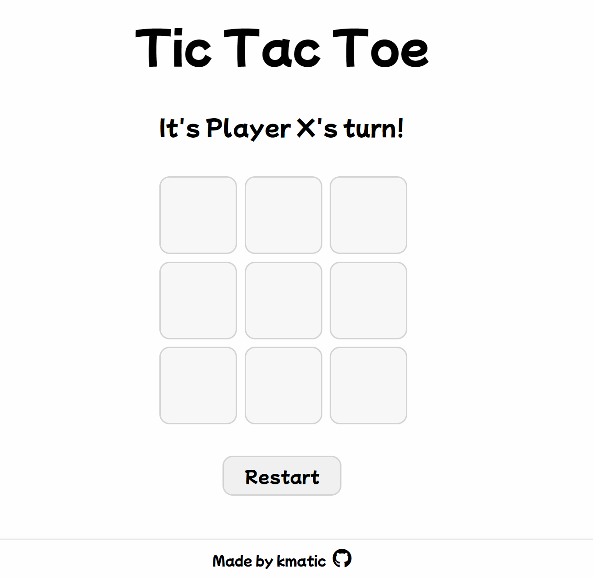

# tic-tac-toe

tic-tac-toe game created in JS, HTML, & CSS. Used factory + modular functions to practice writing cleaner code and keeping everything within its private scope. 

## Demo

[Live Demo](https://kmatic.github.io/tic-tac-toe/)

## To-Do

- Start menu (mode selection)
- Player vs AI 
